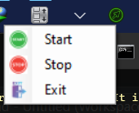

# CursorMon

Cursor Monitoring Tool (C#/.NET)

This application is designed to work in combination with VistaSwitcher now as [Alt-Tab Terminator](http://www.ntwind.com/software/vistaswitcher.html) and i'm use VistaSwitcher [old version](https://www.softpedia.com/get/System/OS-Enhancements/VistaSwitcher.shtml), utilizing specific settings for enhanced task management across multiple monitors.

## Prerequisites

- **.NET Version**: This application requires .NET 7 to run.

## VistaSwitcher Settings

To achieve optimal functionality, ensure the following settings are configured in VistaSwitcher:

1. **Show tasks only from the active monitor.**
2. **Behavior -> Position -> Show VistaSwitcher on: Active Monitor (by cursor position).**

## Shortcut Key

- Use the shortcut **Alt + Shift** to move the position between monitors. This enables quick and efficient switching, ensuring a seamless workflow when working across multiple monitors.

## Overview

CursorMon enhances productivity by integrating cursor monitoring and task management across multiple monitors. It seamlessly works with VistaSwitcher to dynamically adjust the task display and behavior based on the cursor's position.



## Installation

To build and publish CursorMon, follow these steps:
```bash
> dotnet restore
> dotnet build
> dotnet publish -c Release -r win-x64 --self-contained /p:PublishSingleFile=true
```
This will produce cursormon.exe with an approximate size of 159 MB.

If you want to reduce the file size, replace the `--self-contained` flag with `--no-self-contained` to exclude the .NET runtime from the executable.

## Author
[Hadi Cahyadi](mailto:cumulus13@gmail.com)

[](https://www.buymeacoffee.com/cumulus13)

[](https://ko-fi.com/cumulus13)

[Support me on Patreon](https://www.patreon.com/cumulus13)

